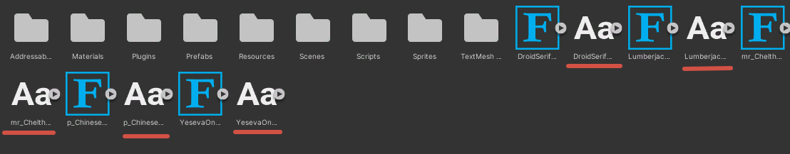
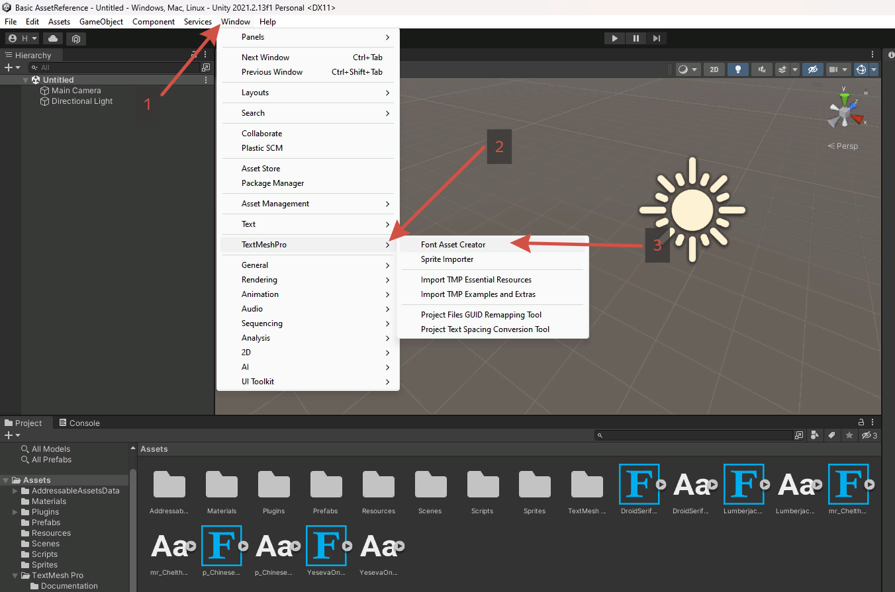
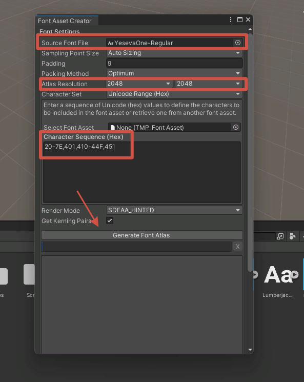
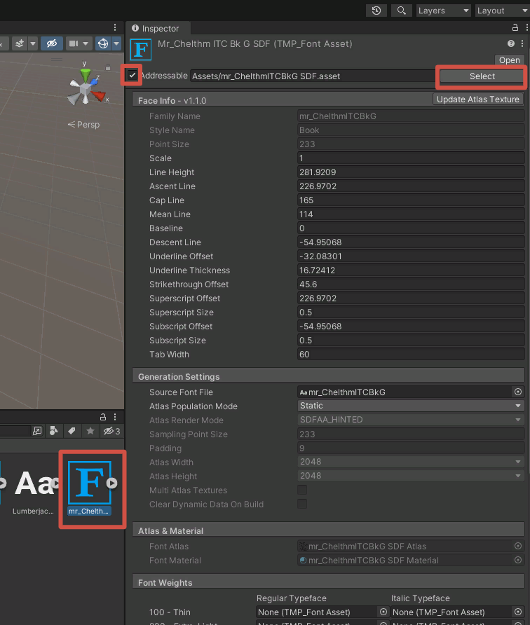
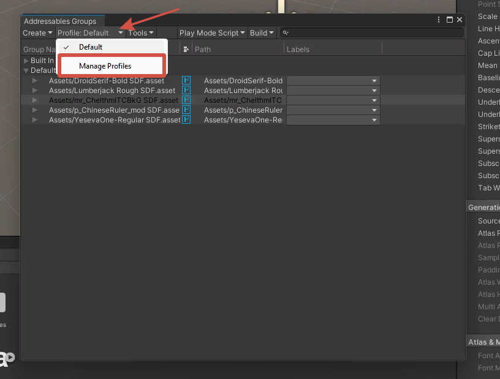
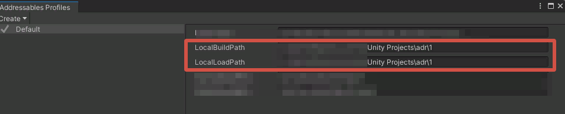
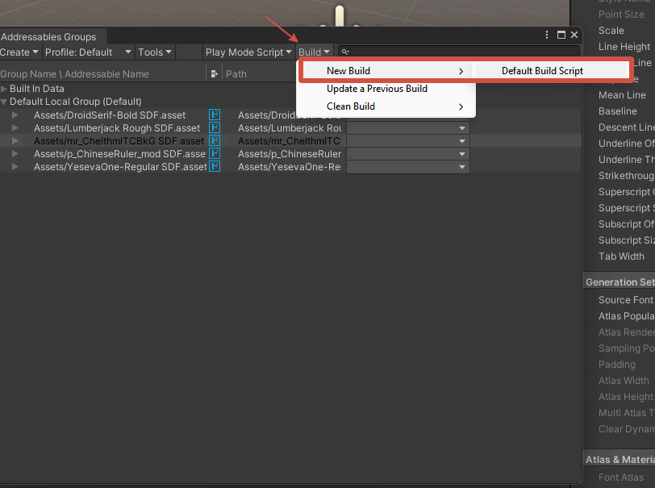
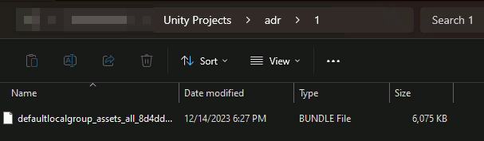

# How to create new translation

As a starting point, copy the directory of the language from which you want to translate, and initialize git repository (optional, but highly recommended).<br>
The `language directory` e.g. `Mods/GloomSlation/Russian` must be the repository's root.

## Text
Inside the `language directory` you can find text files such as `Menus`, `Journal`, etc.
These files have simple format that looks like.
```json
/*
  Block comment
*/
// Line comment
KEY = "line\nNext line"; 
```
Keys should be left unchanged, and each key-value entry should end with `;`.<br>
You can use some escape sequences to insert a newline or tab, like `\n` or `\t` respectively.<br><br>
For now the game has some half-baked localization mechanisms, and they are used where possible.
However, there are still a lot of objects that do not have localization component.
Keys for such object are generated from their name and text.<br><br>
If you the have `debug` preference enabled in the code before the mod's .dll-file build or the `cfg.toml` file (check the russian language release archive for example), there will be log entries about unlocalized objects, containing their generated key and text (or you can just view other translation) in the console window that opens when you start the game with the mod.<br>
Currently, all such keys are stored in `Menus` file.<br><br>
Please note that there are a few dynamic text labels. Their change is handled and will be logged slightly different.<br>
The mod determines which labels to translate by their initial text, 
so be sure to find and provide translation for initial values of such labels. 

## Fonts
Most fonts in the game only support ASCII english characters and symbols, so you will probably have to make a new fonts asset.
This is the most complicated (if you don't count texture editing) step.<br><br>
You can use `Unity Editor` of same version as the game's Unity Engine (`2021.2.13f1` as for game version `0.1.309.19`)
to create font assets. 
Look at [TextMeshPro docs](https://docs.unity3d.com/Packages/com.unity.textmeshpro@3.2/manual/index.html) 
to learn about font settings.<br><br>
For easy start, clone this unity project [repository](https://github.com/Unity-Technologies/Addressables-Sample).

Open the asset folder `Basic` and add `.ttf` or `.otf` fonts to `Basic\Basic AssetReference\Assets`.


Make an SDF Font asset for each of the fonts you want to add by opening the Font Asset Creator.


Select target raw font and choose appropriate atlas size 
(you can make it smaller if you see a lot of free space in generated texture).<br>
Input characters or character ranges you need. You will be able to use **only** these characters, so don't forget to add ASCII range `20-7E`.
Look [here](https://www.ling.upenn.edu/courses/Spring_2003/ling538/UnicodeRanges.html) or 
[here](https://jrgraphix.net/r/Unicode/) to pick appropriate ranges.<br>
Click `Generate Font Atlas` and wait for generation.


For each SDF Font asset you have generated, check the `Addressable` checkbox. 
You need to do this to pack them into `bundle`.

After that click on `Select` button in any of font assets. 


Select `Manage profiles` entry in the opened window.


Edit build output paths to point to any location that you want the `.bundle` file to end up. 


Now build the bundle. **You need to do this and next step again each time you change or add a font.**


Navigate to your chosen location and rename build artifact into `font.bundle`. Now you can move it to `language directory`.


You can also refer to Unity docs on
[`Addressables`](https://docs.unity3d.com/Packages/com.unity.addressables@2.0/manual/get-started-make-addressable.html).

In the `language directory` you will find the `fontMap.json` file, that is used to determine which original font to replace with which new font.
It's a simple json map, where the keys are the original font names and the values are the new font names.<br>
It may also contain special `FALLBACK_FONT` key, which is used when there are no suitable new fonts. 

## Textures
Your `language directory` may also contain `Textures` folder.<br>
Images in `png` format placed in this directory will be loaded into memory and will replace any in-game texture, which name is equal to image name (excluding `.png` extension).<br>
You could extract textures using [AssetStudio](https://github.com/Perfare/AssetStudio) or [AssetRipper](https://github.com/AssetRipper/AssetRipper). The extracted image will have the appropriate name already.

## Audio (Experimental)
Since the mod's update for the game version 0.1.308.19, replacing audio files is supported, although **experimentally (which means that you are likely to encounter some bugs when doing this)**.<br><br>
To replace the game's audio or music files, you need to create `Audio` folder. Audio files should preferably be in either `mp3` or `ogg` format.<br>
A lot of sound assets in game (i.e. footstep sounds, detection phrases, etc) contain several audio tracks, so in order to replace them all, you will need to append `_n` to the end of your audio file's name, where n is the ordered number of the file you want to replace, starting with 0.<br><br>
**Example**:<br>
When a Huntsman hears the player, they can say one of the two phrases named `SFX_HUNTSMAN_ALERT_ONE_HEAR` in the assets. So, to replace both of the possible phrases, your audio files should be named (with file extension): `SFX_HUNTSMAN_ALERT_ONE_HEAR_0.mp3` and `SFX_HUNTSMAN_ALERT_ONE_HEAR_1.mp3`.<br>

You can find out what the name of the asset you need to replace is using the `debug` preference and looking at the console output, by looking through the assets directly (i.e. with AssetRipper) or by trying your luck and naming the audio file after the respective line in the `Dialogs` localization file.
